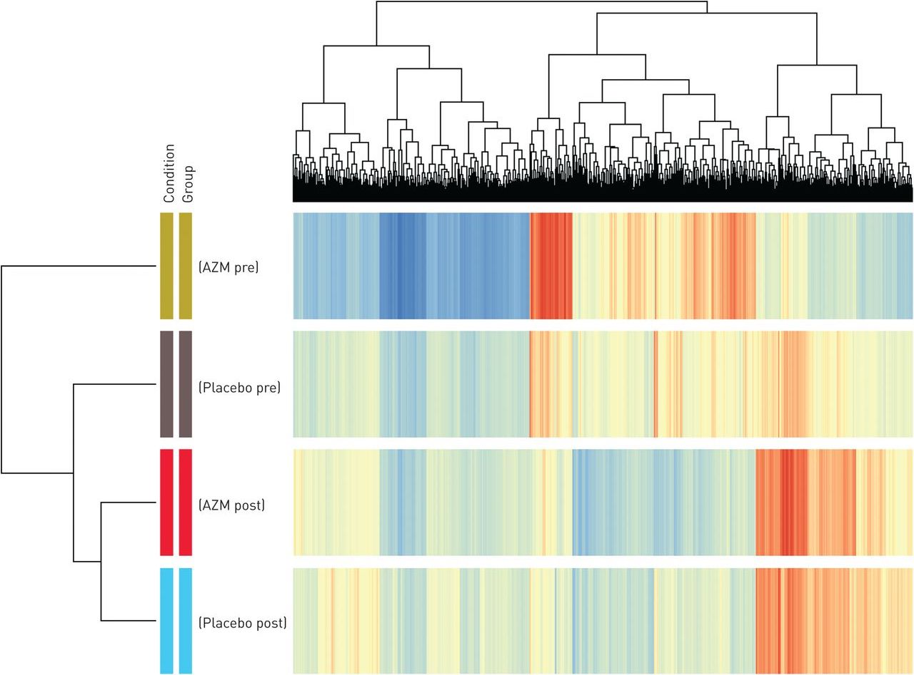

# Knapsack Problem

[The area of Knapsack problems is one of the most active research areas of combinatorial optimization](https://en.wikipedia.org/wiki/Knapsack_problem). The problem is to maximise the value of items placed in a knapsack given the constraint that the total weight of items cannot exceed some limit.

Figure 1 (below) illustrates a simple example.  In this case, the weight of all items in the knapsack cannot exceed 15kg.  Here, the solution is that the maximum value of items in the knapsack is $15, which is attained by including all items apart from the green item. 


<figcaption>Figure 1. Example of Knapsack Problem</figcaption>
<br/>

# Our Challenge

For our challenge, we use a version of the knapsack problem with configurable difficulty, where the following two parameters can be adjusted in order to vary the diffculty of the challenge:

- Parameter 1:  $num\_items$
- Parameter 2: $percent\_better\_than\_expected\_value$

$num\_items$ is the number of items from which you need to select a subset to put in the knapsack. We impose a weight constraint $W(S_{knapsack}) <= 0.5 \cdot W(S_{all})$, where the knapsack can hold at most half the total weight of all items.

For a particular $percent\_better\_than\_expected\_value$, the objective is to find a combination of items such that the total value of items in the knapsack is $percent\_better\_than\_expected\_value$ greater than half the total value of all items:

$$V(S_{knapsack}) >= (1 + \frac{percent\_better\_than\_expected\_value}{100}) \cdot \frac{V(S_{all})}{2}$$

The larger the $num\_items$, the more number of possible $S_{knapsack}$, making the challenge more difficult. Also, the higher $percent\_better\_than\_expected\_value$, the less likely a given $S_{knapsack}$ will be a solution, making the challenge more difficult.

The weight $w_j$ of each of the $num\_items$ is an integer, chosen independently, uniformly at random, and such that each of the item weights $1 <= w_j <= 50$, for $j=1,2,...,num\_items$. The values of the items $v_j$ are similarly selected at random from the same distribution.

## Worked Example

Consider the following example `Challenge` instance with `num_items=6`:

```
weights = [48, 20, 39, 13, 25, 16]
values = [24, 42, 27, 31, 44, 31]
max_weight = 80
min_value = 109
```
The objective is to find a set of items where the total weight is at most 80 but has a total value of at least 109.

Now consider the following selection:

```
selected_items =  [1, 3, 4, 5]
```

When evaluating this selection, we can confirm that the total weight is less than 80, and the total value is more than 109, thereby this selection of items is a solution:

* Total weight = 20 + 13 + 25 + 16 = 74
* Total value = 42 + 31 + 44 + 31 = 148

# Applications

The Knapsack problems have a wide variety of practial applications. The [use of knapsack in integer programming](https://www.sciencedirect.com/science/article/pii/0012365X71900057) led to breakthoughs in several disciplines, including [energy management](https://www.sciencedirect.com/science/article/abs/pii/S0301421513003418) and [cellular network frequency planning](https://www.slideshare.net/deepakecrbs/gsm-frequency-planning). 

Although origionally studied in the context of logistics, Knapsack problems appear regularly in diverse areas of science and technlogy. For example, in gene expression data, there are usually thousands of genes, but only a subset of them are informative for a specific problem. The Knapsack Problem can be used to select a subset of genes (items) that maximizes the total information (value) without exceeding the limit of the number of genes that can be included in the analysis (weight limit).




<figcaption>Figure 2: <a href="https://openres.ersjournals.com/content/4/4/00031-2018" target="_blank">Microarray clustering of differentially expressed genes in blood</a>. Genes are clustered in rows, with red indicating high expression, yellow intermediate expression and blue low expression. The Knapsack problem is <a href="https://www.sciencedirect.com/science/article/abs/pii/S0305054821003877" target="_blank">used to analyse</a> gene expression clustering.</figcaption>
<br/>